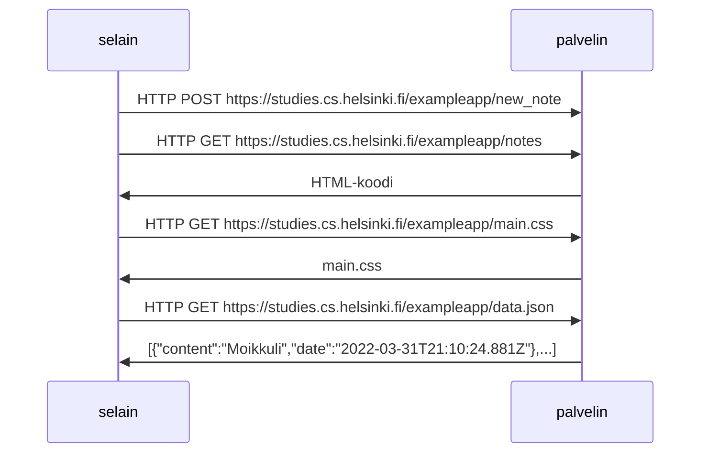

```mermaid
sequenceDiagram
  participant selain
  participant palvelin
  selain->>palvelin: HTTP POST https://studies.cs.helsinki.fi/exampleapp/new_note
  selain->>palvelin: HTTP GET https://studies.cs.helsinki.fi/exampleapp/notes
  palvelin->>selain: HTML-koodi
  selain->>palvelin: HTTP GET https://studies.cs.helsinki.fi/exampleapp/main.css
  palvelin->>selain: main.css
  selain->>palvelin:  HTTP GET https://studies.cs.helsinki.fi/exampleapp/data.json
  palvelin->>selain: [{"content":"Moikkuli","date":"2022-03-31T21:10:24.881Z"},...]
```
